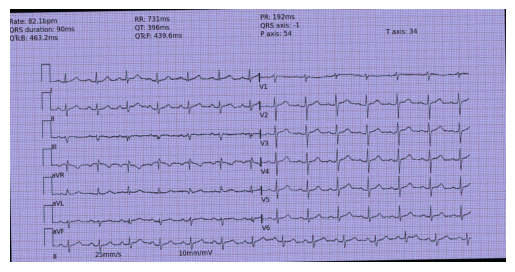

# Vision-Language Model for ECG Diagnostics  
**Master's Research – Technion, Israel Institute of Technology (AIM Lab)**  

## Project Overview  
This repository presents my **Master’s research project** on **Vision-Language Models (VLMs)** applied to **electrocardiogram (ECG) diagnostics**.  
The work builds upon the [PULSE benchmark](https://arxiv.org/abs/2410.19008) and evaluates **SmolVLM-256M-Instruct**, a lightweight open-source VLM fine-tuned for ECG reasoning and classification tasks.

## Objectives  
- Fine-tune **SmolVLM-256M-Instruct (256M parameters)** for ECG-specific reasoning tasks.  
- Benchmark performance against **state-of-the-art proprietary and open-source models** (PULSE-7B, GPT-4o, Gemini, Claude).  
- Focus on the **ECGBench benchmark**, particularly the **CODE15 dataset**, using metrics such as **F1-score, AUC, Hamming Loss (HL)**, and **ANLS**.

## Results – CODE15 (In-Domain)

| Model                   | F1    | AUC   | HL    |
|-------------------------|-------|-------|-------|
| GPT-4o                  | 24.9  | 59.9  | 15.7  |
| Gemini 1.5 Pro          | 20.0  | 56.7  | 15.9  |
| Claude 3.5 Sonnet       | 20.3  | 58.3  | 17.8  |
| LLaVA-Med               | 27.0  | 69.2  | 33.4  |
| MiniCPM-V-2.6           | 25.3  | 56.6  | 22.0  |
| **PULSE-7B**            | **85.4** | **90.7** | **5.0**  |
| **SmolVLM-256M (Ours)** | 27.5  | 65.3  | 16.5  |

**ANLS (SmolVLM-256M):** 68.7

**Key Insight:**  
Our **SmolVLM-256M** performs in the upper range of open-source models while remaining **lightweight and efficient**.  
**PULSE-7B** remains the leader, but our model demonstrates strong adaptability for its size.

## Sample Predictions (CODE15)

### Example 1 – Correct Prediction  

**Prompt:**  
*The ECG image above belongs to a 54-year-old patient. Identify the cardiac rhythm and classify whether it is NORMAL or ABNORMAL.*  
**Ground Truth:** ABNORMAL – Atrial Fibrillation  
**Prediction (Ours):** ABNORMAL – Atrial Fibrillation  

### Example 2 – Diagnostic Report  

**Prompt:**  
*Evaluate the ECG and write a comprehensive diagnostic report.*  
**Ground Truth:** Normal sinus rhythm, no arrhythmia or conduction issues.  
**Prediction (Ours):** Sinus rhythm, low QRS voltages (may suggest mild conduction abnormalities).  

### Example 3 – Incorrect Prediction  

**Prompt:**  
*Classify the ECG condition (NORMAL or ABNORMAL) and specify the rhythm.*  
**Ground Truth:** ABNORMAL – Ventricular Tachycardia  
**Prediction (Ours):** NORMAL – Sinus Rhythm  

## Research Context  
This project draws inspiration from the **PULSE benchmark**, which sets a new standard for ECG reasoning with VLMs.  
Our work demonstrates that **smaller, optimized models** like SmolVLM can achieve competitive results with targeted fine-tuning.

## About Me  
I am a Master’s student in **Engineering & Artificial Intelligence** at **Ecole Centrale d'Electronique - ECE Paris**, currently completing my final year at the **Technion – Israel Institute of Technology (AIM Lab)**.  

**Focus areas:**  
- Vision-Language Models (VLMs) and Multimodal AI  
- Deep Learning for Healthcare Applications  
- Model Efficiency and Domain Adaptation  

## References  
- **PULSE:** [PULSE: A Unified Benchmark for ECG Reasoning with VLMs](https://arxiv.org/abs/2410.19008)  
- **SmolVLM:** SmolVLM-256M-Instruct – Hugging Face  
